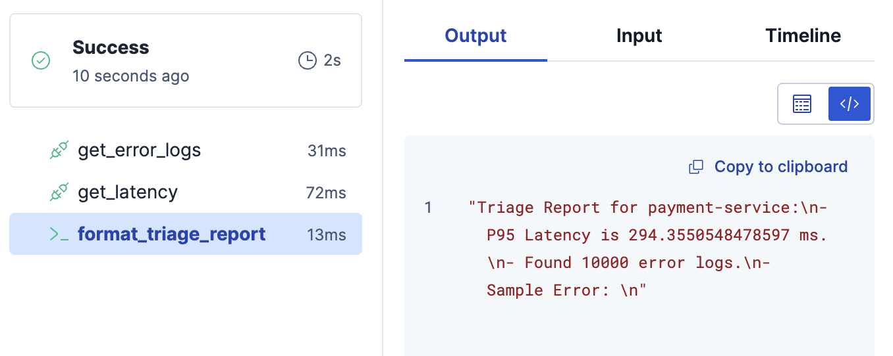
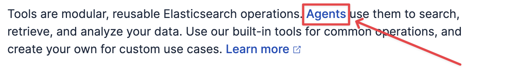

# 📖 Challenge 6: The "Full Circle" - The Observability Triage Bot

So far, our workflows have called Agent Builder Agents. Now, let's make an **Agent call our workflow**.

This "full circle" integration is the key concept. We will give an Agent Builder Agent a "Workflow Tool" to run automation on its behalf.

**Goal:** We will build an "SRE Triage Bot."  When we ask it to "triage a service," it will run a workflow to pull logs and metrics from our `o11y-heartbeat` index, then give us a summary.

## Part 1: Build the Workflow "Tool"

We'll build a workflow that handles data retrieval from our index.

1. Click on **Create a new workflow**
2. Paste this entire workflow.
   - **Read it carefully.** It uses a new step type:
     - `elasticsearch.search`, which can query Elasticsearch with the `_search` API
     - Here we will query our custom `o11y-heartbeat` index.

```yaml
version: "1"
name: triage_service_incident
description: "Triage a service by querying observability data"
enabled: true

inputs:
  - name: service_name
    type: string
    required: true
    description: "The name of the service to triage"

triggers:
  - type: manual

steps:
  # Get 5 most recent 5xx error messages
  - name: get_error_logs
    type: elasticsearch.search
    with:
      index: "o11y-heartbeat"
      query:
        bool:
          must:
            - term:
                service.name: "{{ inputs.service_name }}"
            - range:
                http.status_code:
                  gte: 500
      size: 5

  # Get the P95 latency
  - name: get_latency
    type: elasticsearch.search
    with:
      index: "o11y-heartbeat"
      query:
        term:
          service.name: "{{ inputs.service_name }}"
      aggs:
        p95_latency:
          percentiles:
            field: "latency_ms"
            percents: [95]
      size: 0

  # Format a report for the AI
  - name: format_triage_report
    type: console
    with:
      message: |
        Triage Report for {{ inputs.service_name }}:
        - P95 Latency is {{ steps.get_latency.output.aggregations.p95_latency.values["95.0"] }} ms.
        - Found {{ steps.get_error_logs.output.hits.total.value }} error logs.
        - Sample Error: {{ steps.get_error_logs.output.hits.hits[0]._source.log.message }}
```

3. **Save** this workflow. Do NOT run it yet.

---
## Part 2: Test the Workflow Manually

Before creating the tool, let's verify the workflow works:

1. Click ▶️ (run) on the workflow.
2. For `service_name`, enter: `payment-service`
    
3. Observe the three steps execute.
4. Check the `format_triage_report` output—you should see latency stats and error counts.
    

---
## Part 3: Create the Workflow Tool

Now we need to create a **Tool** that wraps this workflow. Tools are what agents use to interact with workflows.

1. Click on the [button label="Agent Builder"](tab-1) tab
2. Click on **"Manage Tools"** (under the text chat box).
3. Click **"New tool"** (top right).
4. Configure the tool:
   - **Type**: Select **"Workflow"**
   - **Tool ID**: `triage_service_incident`
   - **Description**: `Queries observability data for service triage`
   - **Workflow** (Configuration Section): Select `triage_service_incident` from the dropdown
5. Click **"Save"** to create the tool.

You've now created a reusable tool that agents can use!

---
## Part 4: Attach the Tool to the Agent

Now we'll attach this tool to the `sre_triage_bot` agent that was created during setup.

1. Still in **Agent Builder**, click on **"Agents"** (in top description).
    
2. Find `SRE Triage Bot` and click ✏️ (edit).
    
3. Click on the **"Tools"** section at the top.
5. From the tool dropdown, select `triage_service_incident` (the tool you just created).
    
6. Click **"Save"** to save the agent configuration.

The agent now has access to your workflow through the tool!

---
## Part 5: Run the "Full Circle"

1. On the line for `SRE Triage Bot` click on the 💬 (chat) bubble to start a chat using this bot.
    
2. In the chat window, type:

   ```
   Hey, can you please run triage on the "payment-service"?
   ```
    
3. Click *return* on your keyboard or click the ⬆️ button to send your question.

4. **Observe:**
   * The agent will respond that it is "Thinking" or other such comments
   * In the background, it just triggered your workflow and passed it `payment-service` as the input.
   * It will get the formatted "Triage Report" message back from the workflow.
   * It will then present this data to you in natural language.

Click on the `>` next to `Thinking Completed` to expand the full "thinking" stream the agent used
    

You have closed the loop. The Agent is now a "conversational front-end" for your complex automation.

**Click "Next" for the final capstone challenge.**
