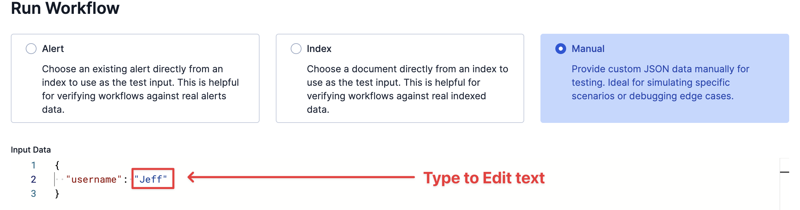

# 📖 Challenge 2: Building Your First Workflow

Let's start with the "Hello, World!" of automation. We will build a simple workflow that takes a user's name as input and prints a greeting to the console.

## 1. Find the Workflow UI

In the [button label="Kibana"](tab-0) tab:

You should be in the **Workflows** UI. If you switched out of it:
   1. Go to the main menu (the "hamburger" icon).
   2. Navigate to **Management > Workflows**.
   3. This opens the Workflows UI (a new Tech Preview feature).

## 2. Create a New Workflow

1. Click **"Create a new workflow"**.
    
2. This will open the YAML editor. Delete all the boilerplate text.

## 3. Define the Inputs

A workflow needs to know what data it expects. Paste this `inputs` block.
- It tells the workflow to expect one `string` called `username`.

```yaml
version: "1"
name: hello_world
enabled: true

inputs:
  - name: username
    type: string
    required: true
    description: "The name of the user to greet"
```

## 4. Define the Steps

Now, let's tell the workflow *what to do*. We'll add a `steps` block with one `console` step.

Paste this *below* your `inputs` block:

```yaml
triggers:
  - type: manual

steps:
  - name: print_greeting
    type: console
    with:
      message: "Hello, {{ inputs.username }}!"
```

> [!IMPORTANT]
> Spaces in YAML are important
> `triggers` and `steps` should be at the beginning of the line, no indents.

<details>
  <summary>Click to see Full YAML</summary>

```yaml
version: "1"
name: hello_world
enabled: true

inputs:
  - name: username
    type: string
    required: true
    description: "The name of the user to greet"

triggers:
  - type: manual

steps:
  - name: print_greeting
    type: console
    with:
      message: "Hello, {{ inputs.username }}!"
```

</details>

**Look closely at the `message`:**

* We use `{{ ... }}` (Liquid templating) to access data.
* `inputs.username` directly references the input we defined!

## 5. Save and Run the Workflow

1. Click **"Save"** in the top right.
2. Now, click the top ▶️ (run) button (next to save).
    
3. A panel will appear asking for the `username`.
4. In the `username` field, replace the placeholder text "Enter a string" with your actual name (e.g., "Alex") and click **"Run"**.
    

## 6. Check the Output

You will see the workflow run in real-time.

* Click on the `print_greeting` step.
* In the **Output** tab, you should see your message: `"Hello, Alex!"` (or whatever name you enter!)


You've built and run your first workflow!

**Click "Next" to continue.**
