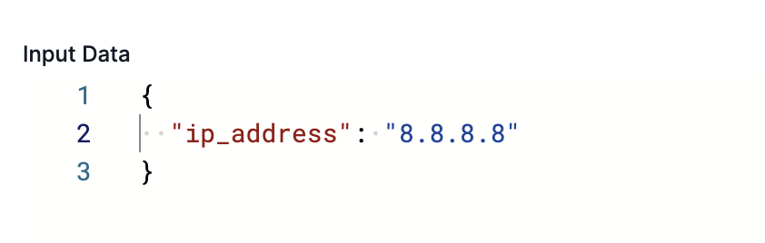
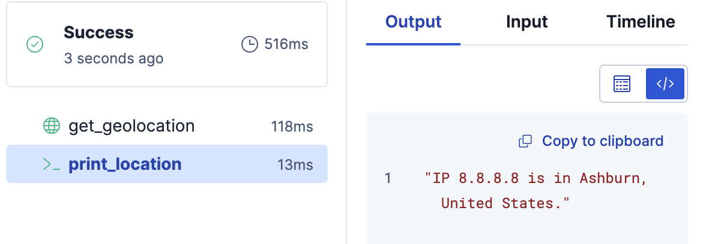

# 📖 Challenge 3: Chaining Steps - From Input to Output

Workflows are versatile because they are a *chain*. The output of one step becomes the input for the next.

Let's build a workflow that takes an IP address, enriches it with a free geolocation API, and then prints the location.

## 1. Create a New Workflow

1. Open the [button label="Kibana - Workflows"](tab-0) tab,
2. Click **Create a new workflow**.

## 2. Define Inputs and Constants

We'll centralize the API base URL so it's defined once. In production, pass it as an input or from config; don't hardcode secrets.

Paste this as your base:

```yaml
version: "1"
name: ip_geolocator
description: "Geolocate an IP address using a public API"
enabled: true

consts:
  ip_api_base_url: http://ip-api.com/json

inputs:
  - name: ip_address
    type: string
    required: true
    description: "The IP to geolocate (e.g., 8.8.8.8)"

triggers:
  - type: manual
```

## 3. Add the `http` Step

This is the workhorse. We will add an `http` step to call the API.

Add this `steps` block below your `triggers`:

```yaml
steps:
  - name: get_geolocation
    type: http
    with:
      url: "{{ consts.ip_api_base_url }}/{{ inputs.ip_address }}"
      method: GET
```

**Analysis:**

* `type: http`: Tells the workflow to make a web request.
* `url:`: We build the URL *dynamically*, combining our `consts` and our `inputs`.

## 4. Add the "Chained" Step

Now, add a *second* step that *uses the output* of the first.

Add this *below* your `get_geolocation` step (inside the `steps` array):

```yaml
  - name: print_location
    type: console
    with:
      message: "IP {{ inputs.ip_address }} is in {{ steps.get_geolocation.output.data.city }}, {{ steps.get_geolocation.output.data.country }}."
```

**This is the most important concept:**

`steps.get_geolocation.output.data.city`:
- We are accessing the `output` of the step named `get_geolocation` and digging into its JSON structure
  - The actual data is nested under `output.data`.

<details>
  <summary>Click here to expand full workflow YAML</summary>

```yaml
version: "1"
name: ip_geolocator
description: "Geolocate an IP address using a public API"
enabled: true

consts:
  ip_api_base_url: http://ip-api.com/json

inputs:
  - name: ip_address
    type: string
    required: true
    description: "The IP to geolocate (e.g., 8.8.8.8)"

triggers:
  - type: manual

steps:
  - name: get_geolocation
    type: http
    with:
      url: "{{ consts.ip_api_base_url }}/{{ inputs.ip_address }}"
      method: GET

  - name: print_location
    type: console
    with:
      message: "IP {{ inputs.ip_address }} is in {{ steps.get_geolocation.output.data.city }}, {{ steps.get_geolocation.output.data.country }}."
```
</details>

## 5. Run and Verify

1. **Save** the workflow.
2. **Run** it.
3. For the `ip_address` input, use `8.8.8.8`.
    
4. Let it run, then click the `print_location` step.
5. Check the **Output** tab. You should see: `"IP 8.8.8.8 is in Ashburn, United States."`
    > [!NOTE]
    > The exact city name may differ

    

You just chained two steps!

**Click "Next" to learn how to make this workflow more sophisticated.**
