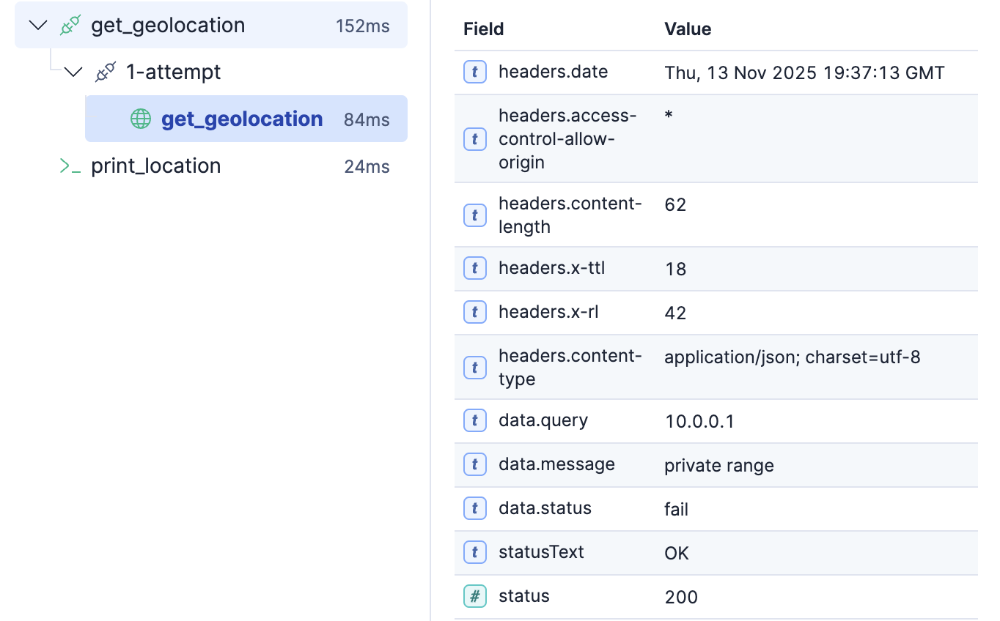

# 📖 Challenge 4: Making it Robust - Logic & Error Handling

Real-world automation must handle errors and make decisions. Let's add `on-failure` retries and `` logic to our IP workflow.

## 1. Open Your `ip_geolocator` Workflow
You should still be in the  [button label="Kibana - Workflows"](tab-0) tab

1. Click on the  `ip_geolocator` workflow you just built.

## 2. Add Error Handling

What if the API call fails? Let's add an `on-failure` block to the `http` step.

Modify your `get_geolocation` step to look like this:

```yaml
  - name: get_geolocation
    type: http
    with:
      url: "{{ consts.ip_api_base_url }}/{{ inputs.ip_address }}"
      method: GET
    on-failure:
      retry:
        max-attempts: 2
        delay: 1s
```

This tells the workflow to "try this step 2 times, waiting 1 second between failures" before giving up.

## 3. Add Conditional Logic

What if we want to do different things based on the *result*? Let's change our `console` message to use Jinja `if` logic.

Replace your *entire* `print_location` step with this:

```yaml
- name: print_location
  type: console
  with:
    message: >-
      
      
      
      
      
      

      
        
          🇺🇸 United States-based IP from {{ city }}.
        
          🇪🇺 Europe-based IP from {{ city }}, {{ country }}.
        
          🌏 Asia-based IP from {{ city }}, {{ country }}.
        
          🌍 IP from {{ country }}.
        
      
        This IP could not be geolocated (private or unknown range).
      
```

This logic block checks the `countryCode` from the API response and changes the message.

## 4. Test All Scenarios

1. Save your workflow.

2. Test 1 (**United States** path):
   - Run with ip_address: `8.8.8.8`
   - Check output under **print_location**
     - “🇺🇸 United States-based IP from …”

3. Test 2 (**Europe** path):
   - Run with ip_address: `81.2.69.142` (United Kingdom)
   - Check output **print_location**
     - “🇪🇺 Europe-based IP from …, United Kingdom”

4. Test 3 (**Asia** path):
   - Run with ip_address: `114.114.114.114` (China)
   - Check output **print_location**
     - “🌏 Asia-based IP from …, China”

5. Test 4 (**Private/unknown** path):
   - Run with ip_address: 1`0.0.0.1` (private IP)
   - **Observe**: Under `get_geolocation` > `1-attempt` > `get_location`
     - `HTTP 200` with `data.status`: `fail` and no city/country
    
   - You’ll see under  **print_location**
     - “This IP could not be geolocated (private or unknown range).”
You've built a workflow that can make decisions and handle errors!

**Click "Next" to bring in the Agents.**
