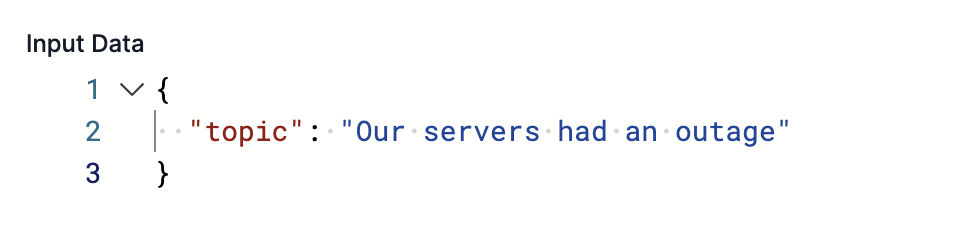

# 📖 Challenge 5: The AI "Assembly Line"

A workflow's true power is orchestrating a *team* of specialized AI agents. You can build an "assembly line" to generate, validate, and remediate content. This is the "Generator-Critic-Remediator" pattern.

Our setup script has pre-built 3 agents for you:

* `agent_content_creator` (The "Generator")
* `agent_sentiment_analyzer` (The "Critic" - returns JSON)
* `agent_pr_spin_specialist` (The "Remediator")

Let's build a workflow that uses all three.

## 1. Create a New Workflow

1. Click on **Create a new workflow**
2. Paste this as your starting block (replace the placeholder text).
   - Our `input` is just a `topic`.

```yaml
version: "1"
name: ai_content_chain
description: "Orchestrate AI agents to generate, analyze, and improve content"
enabled: true

inputs:
  - name: topic
    type: string
    required: true
    description: "The topic for the press release"

triggers:
  - type: manual

steps:
  # Steps will go here
```

## 2. Step 1: The "Generator"

Add your first step. This calls the `agent_content_creator`.

```yaml
  - name: draft_content
    type: kibana.post_agent_builder_converse
    with:
      agent_id: agent_content_creator
      input: "Write a short, 1-2 sentence press release about this topic: {{ inputs.topic }}"
```

## 3. Step 2: The "Critic"

Now, let's *check* the work of the first agent. Add this step, which feeds the *output* of Step 1 into our `agent_sentiment_analyzer`.

```yaml
  - name: first_check
    type: kibana.post_agent_builder_converse
    with:
      agent_id: agent_sentiment_analyzer
      input: "{{ steps.draft_content.output.response.message }}"
```

## 4. Step 3: The "Remediator" (The "Spin Doctor")

Now for the magic. We'll call the `agent_pr_spin_specialist`, but we'll give it *both* the original draft *and* the bad sentiment.

```yaml
  - name: remediation_spin
    type: kibana.post_agent_builder_converse
    with:
      agent_id: agent_pr_spin_specialist
      input: |
        The following draft was written:
        "{{ steps.draft_content.output.response.message }}"

        It was analyzed with this sentiment:
        "{{ steps.first_check.output.response.message.sentiment }}"

        Please revise this draft to have a strongly positive spin.
```

## 5. Step 4 & 5: Final Check & Report

Finally, let's check the "spun" draft and print a final report.

```yaml
  - name: final_check
    type: kibana.post_agent_builder_converse
    with:
      agent_id: agent_sentiment_analyzer
      input: "{{ steps.remediation_spin.output.response.message }}"

  - name: final_report
    type: console
    with:
      message: >-
        
        

        ***
        Original Draft: {{ steps.draft_content.output.response.message }}
        Original Sentiment: {{ orig.sentiment }}
        ***
        Revised Draft: {{ steps.remediation_spin.output.response.message }}
        Final Sentiment: {{ fin.sentiment }}
        ***
        
        ✅ PASSED: Content sentiment is positive after remediation.
        
        ❌ FAILED: Content still has negative sentiment after remediation.
        
```

<details>
  <summary>Click here to expand full workflow YAML</summary>

  <pre><code>
version: "1"
name: ai_content_chain
description: "Orchestrate AI agents to generate, analyze, and improve content"
enabled: true

inputs:
  - name: topic
    type: string
    required: true
    description: "The topic for the press release"

triggers:
  - type: manual

steps:
  - name: draft_content
    type: kibana.post_agent_builder_converse
    with:
      agent_id: agent_content_creator
      input: "Write a short, 1-2 sentence press release about this topic: {{ inputs.topic }}"

  - name: first_check
    type: kibana.post_agent_builder_converse
    with:
      agent_id: agent_sentiment_analyzer
      input: "{{ steps.draft_content.output.response.message }}"

  - name: remediation_spin
    type: kibana.post_agent_builder_converse
    with:
      agent_id: agent_pr_spin_specialist
      input: |
        The following draft was written:
        "{{ steps.draft_content.output.response.message }}"

        It was analyzed with this sentiment:
        "{{ steps.first_check.output.response.message.sentiment }}"

        Please revise this draft to have a strongly positive spin.

  - name: final_check
    type: kibana.post_agent_builder_converse
    with:
      agent_id: agent_sentiment_analyzer
      input: "{{ steps.remediation_spin.output.response.message }}"

  - name: final_report
    type: console
    with:
      message: >-
        
        

        ***
        Original Draft: {{ steps.draft_content.output.response.message }}
        Original Sentiment: {{ orig.sentiment }}
        ***
        Revised Draft: {{ steps.remediation_spin.output.response.message }}
        Final Sentiment: {{ fin.sentiment }}
        ***
        
        ✅ PASSED: Content sentiment is positive after remediation.
        
        ❌ FAILED: Content still has negative sentiment after remediation.
        

</code></pre>
</details>

## 6. Run and Analyze

1. **Save** your workflow.
2. **Run** it.
3. For the `topic`, enter something (in the `input Data` JSON) negative:
    ```
    Our servers had an outage
    ```
    
4. Run the workflow click on each step to see what happens
- `draft_conten` - The short status message is created based on your input.
- `first_check` - the sentiment comes back `NEGATIVE` (assuming you put in the negative example).
- `remediation_spin` - This agent puts a nice PR positive spin on a response that would be sent out after the issue is remediated.
- `final_check` - We ensure the spin was positive.
- `final_report` - We a PR friendly incident report


You just built an AI assembly line!

**Click "Next" for the final piece of the puzzle.**
