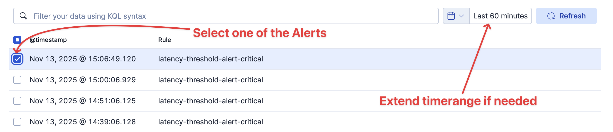
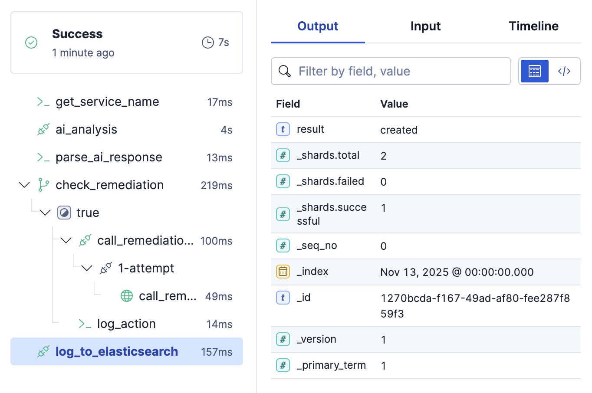
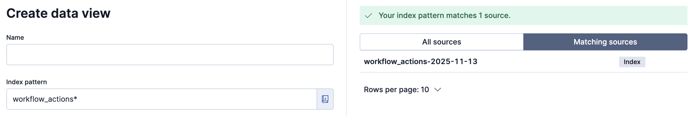
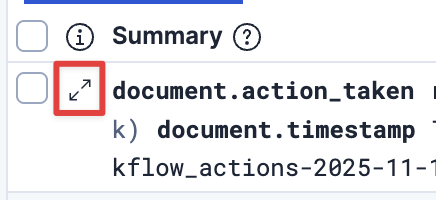
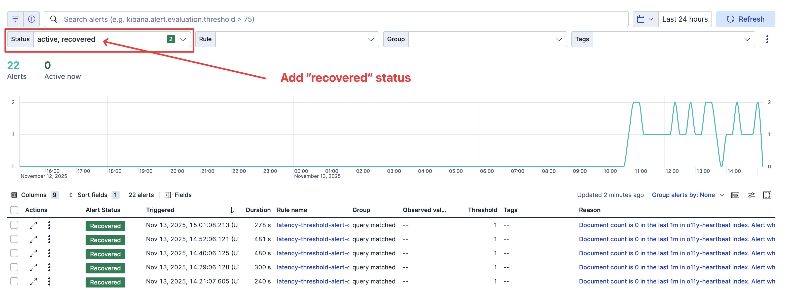
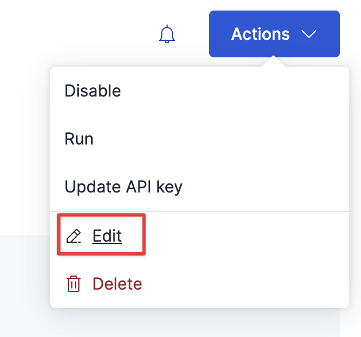
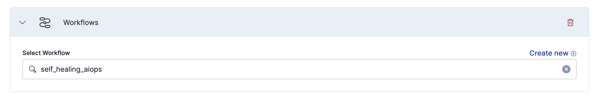

# 📖 Challenge 7: Capstone - Build a "Self-Healing" AIOps Workflow

We will combine what we've learned to build a "self-healing" workflow.

## Scenario setup

A background data sprayer has been running since the start of the workshop. It continuously generates synthetic observability data for several demo services (e.g., payment-service, order-processor), and periodically injects short “incident-level” anomalies (spikes in latency and errors). This creates realistic conditions to test alerting and automation without relying on external systems.

We’ve already created a threshold alert rule: `latency-threshold-alert-critical`. When the data sprayer injects a latency spike, this alert fires automatically.

In this challenge, you will build a workflow that:
- Triggers automatically from that alert
- Uses an Agent Builder agent to decide on a remediation action
- Calls a Mock Remediation API to “restart” the impacted service
- Log the outcome for auditing

---
## 1. Create the Workflow

1. Create a new workflow named `self_healing_aiops`.
2. Paste this starting block.

 ```yaml
version: "1"
name: self_healing_aiops
description: "Self-healing workflow triggered by alerts"
enabled: true

inputs: [] # <-- No inputs needed, the alert *is* the input

triggers:
  - type: alert
```

 **Notice the `triggers` block**
   * `type: alert`: This is the new trigger type.
   * This workflow will now run *automatically* every time any alert fires (we'll configure the alert to trigger this below).


---
## 2. Add the Steps

Now, paste this entire `steps` block below your `triggers`. Read each step's comments to see how it combines all our concepts.

```yaml
steps:
  # Step 1: Parse service name from the alert query
  - name: get_service_name
    type: console
    with:
      message: |
        
        Alert '{{ event.alerts[0]['kibana.alert.rule.name'] }}' fired!
        Service: {{ esQuery.query.bool.filter[1].term['service.name'] }}
        Alert ID: {{ event.alerts[0]['_id'] }}

  # Step 2: Call AI agent for remediation decision
  - name: ai_analysis
    type: ai.agent
    with:
      agent_id: agent_content_creator
      message: |
        
        A critical latency anomaly was detected for service: {{ esQuery.query.bool.filter[1].term['service.name'] }}
        Respond ONLY with the following JSON:
        {"remediation": "restart_service"}

  # Step 3: Parse and check AI response
  - name: parse_ai_response
    type: console
    with:
      message: |-
        {{ parsed.remediation }}

  - name: check_remediation
    type: if
    condition: "${{ steps.parse_ai_response.output == 'restart_service' }}"
    steps:
      - name: call_remediation_api
        type: http
        with:
          url: "http://host-1:3000/remediate_service"
          method: POST
          headers:
            Content-Type: application/json
          body:
            service_name: "payment-service"
        on-failure:
          retry:
            max-attempts: 2

      - name: log_action
        type: console
        with:
          message: "✅ Successfully triggered remediation!"
    else:
      - name: log_no_action
        type: console
        with:
          message: "⚠️ No action taken."

  # Step 4: Index the results back into Elastic for auditing
  - name: log_to_elasticsearch
    type: elasticsearch.request
    with:
      method: PUT
      path: "/workflow_actions-{{ execution.startedAt | date: '%Y-%m-%d' }}/_doc/{{ execution.id }}"
      body:
        timestamp: "{{ execution.startedAt }}"
        workflow_name: "self_healing_aiops"
        alert_id: "{{ event.alerts[0]['_id'] }}"
        alert_name: "{{ event.alerts[0]['kibana.alert.rule.name'] }}"
        action_taken: "{{ steps.call_remediation_api.output.data.status }}"
        remediation_id: "{{ steps.call_remediation_api.output.data.remediation_id }}"
```

---
## 3. Test the Alert Trigger
The normal process now is to configure the Alert to trigger this workflow when the alert fires. We will do that below (optionally), but first lets test.
1. Click the ▶️ (run) button for this `self_healing_aiops` workflow
2. Select one of the `latency-threshold-alert-critical` alerts that has fired while we have been working on our labs.
  - **Important:** Be sure to select a `latency-threshold-alert-critical` alert. Do not select a business impact alert if present.
  - If you don't see an alert, extend the timepicker to a wider range, 60 minutes for example.
    
3. Click **Run**
4. Watch it execute step-by-step:
   * `get_service_name` - parses service name from alert query
   * `ai_analysis` - gets `{"remediation": "restart_service"}`
   * `parse_ai_response` - extracts remediation action
   * `check_remediation` - condition is `true`
   * `call_remediation_api` - sends a POST to our mock server
   * `log_action` - logs success message
   * `log_to_elasticsearch` - writes the audit log
  

---
## 4. Verify Remediation

In the [button label="Terminal"](tab-2)  tab, check the mock API logs:

```bash,run
pm2 logs mock-api --lines 20
```

You should see a log entry showing the remediation was triggered!


---
## 5. Check the Audit Log
Click on the [button label="Kibana - Discover"](tab-3) tab
1. Click on the **Data view** drop down
2. Click on **Create a data view**
    
3. type in `workflow_actions*` in the **Index Pattern** text box
   - You should see one matching index under **Matching sources**
    
4. Click **Save data view to Kibana** on the bottom of the form

You should see one or more documents depending on how many times you ran
1. Click on the document expand arrows

2. You'll see details of the logged workflow run
    

---
## 6. Enhance the Logging (Optional)

The mock remediation API returns rich metadata but we are only capturing if it was successful or not.

1. Click on the [button label="Kibana - Workflows"](tab-0) tab
2. Click on `self_healing_aiops`
3. Update your Step 3 `log_action` step to display more information:
```yaml
- name: log_action
  type: console
  with:
    message: |
      {{ steps.call_remediation_api.output.data.message }}
      📋 Remediation ID: {{ steps.call_remediation_api.output.data.remediation_id }}
      🔧 Service: {{ steps.call_remediation_api.output.data.service }}
      ⚡ Action: {{ steps.call_remediation_api.output.data.action }}
      ⏱️  Estimated Duration: {{ steps.call_remediation_api.output.data.details.estimated_duration }}
```
4. Save and trigger another alert to see the enhanced output!

---
## 7. Configure the Alert
*This step is optional*
Since we already tested our workflow, we know it works. But follow these steps to see how to configure the alert to trigger the workflow

1. Click the [button label="Alerts"](tab-0) tab
2. Click `Status` and select `recovered` to see the previously recovered
   - *note*: they have recovered because the lookback time range is shorter than the frequency which which we are injecting anomalies
    
3. Click on **Manage Rules** at the top right
4. Click on the one alert - `	latency-threshold-alert-critical`
5. Click **Actions** in the top right
6. Click **Edit**
    
7. **Save** your workflow.
8. Now... we wait. The data sprayer running in the background injects an anomaly every 60-90 seconds.
9. In a **new Kibana tab**, go to **Observability > Alerts**.
10. Set your time-picker to **"Last 15 minutes"**.
11. Within a few minutes, you should see the `latency-threshold-alert-critical` fire for a service (e.g., `payment-service`).
12. Scroll down to the **Actions** section and click on `Add action`
    
13. Click on **Workflows**
14. In the **Select Worflows** drop down, select `self_healing_aiops`
    
15. Scroll down and click on **Save rule**
    

The next time the alert fires, it will run your new workflow!

---
Click **Next** to view a final wrap up