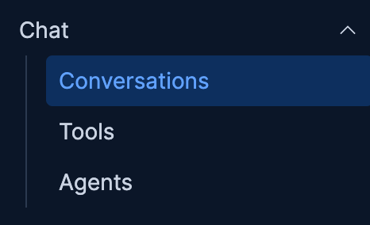

On this challenge you will:
- Configure the Chat Completion LLM connection
- Confirm you can Chat with Robots 🤖

> [!NOTE]
> Click `close` on the dialog box in the upper left
> 

Configure LLM Connector
==

1. Click on the [button label="Kibana - Chat"](tab-0) tab (`Chat` -> `Conversations` )

2. Click on **AI Assistant** in the top right of the tab
3. Click on **Set up GenAI connector**

4. Click the **OpenAI** button

5. Fill out the form using the variable below, The API key is unique to you and vaild only for this workshop!
- Connector Name =>
```
OpenAI
```
- **URL** =>
```
[[ Instruqt-Var key="LLM_CHAT_URL" hostname="kubernetes-vm" ]]
```
- **Default model** =>
```
gpt-4o
```
- Leave `OpenAI Organization` blank =>
```nocopy


```
- Leave  `OpenAI Project`  blank =>
```nocopy


```
   - **API Key** =>
```
[[ Instruqt-Var key="LLM_KEY" hostname="kubernetes-vm" ]]
```

7. Click Save
    - You will see a pop letting you know the connector was created
    
8. Click on the `X` or click off of the flyout to close the AI Assistant panel


Test Chat UI
==
You should still be in `Chat` -> `Conversations`

Ask a question like
```
Are you online?
```
or

```
What can you help with?
```
You should get a response similar to the screenshot below.

_click the image to enlarge_
