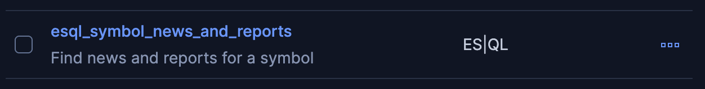

# On this challenge you will:
- Create new custom tools for our MCP Server
---
# Create Your First Custom Tool

1. Click on [button label="Kibana - Tools"](tab-0) tab (Chat -> Tools)
2. Click on `New Tool`

3. under `Tool ID` put:
```
esql_symbol_news_and_reports
```
4. Under `Description` put:
```
Find news and reports for a symbol
```
5. Under `ES|QL` put:
```
FROM financial_news, financial_reports
  | where MATCH(primary_symbol, ?symbol)
  | limit 5
```
6. Click on `Infer parameters from query` under the ES|QL Parameters section:


7. You should see a `symbol` entry. In the `description` box for that row put:
```
The asset symbol to lookup
```
8. Leave the `type` as
```nocopy
text
```

- *click image to enlarge*

9. Click `Save`

You'll see a toast message letting you know the tool has been created


You'll also see our new tool in the tools list:

