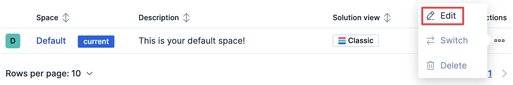
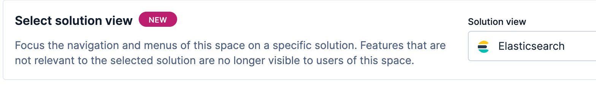
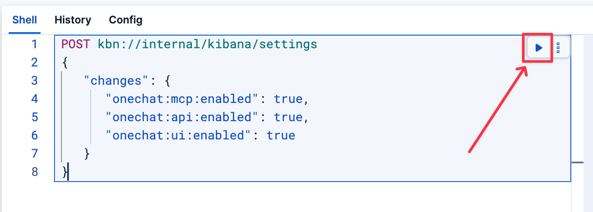
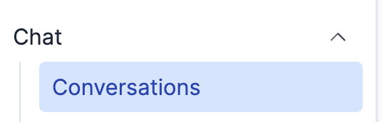
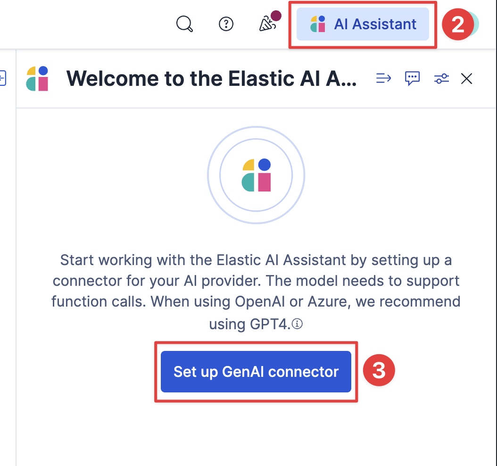
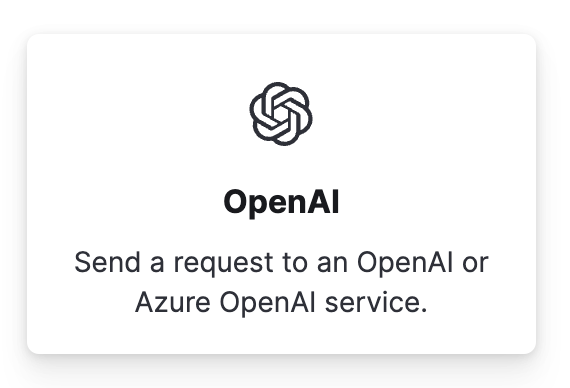
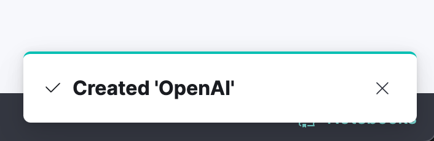
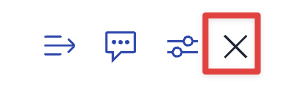
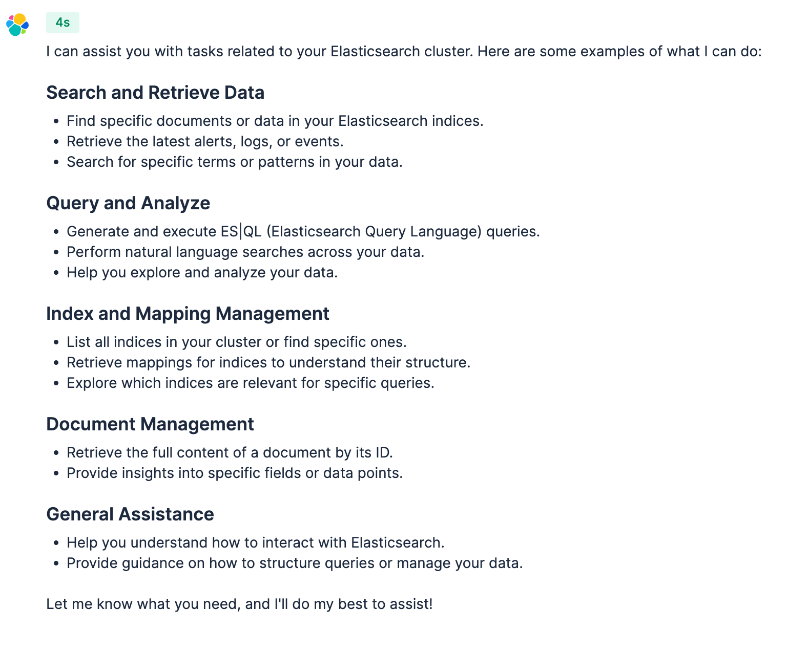

On this challenge you:
- Set the feature flags to enable OneChat and  APIs.
- Confiture the Chat Completion LLM connection

Configure OneChat and Chat UI
===
> [!NOTE]
> This step is only necessary until OneChat is released for public preview

## Create Search Space
1. Open the [button label="Kibana - Spaces"](tab-0) tab
    - This is the Spaces management section of Kibana
3. Click "Edit" in the far right pop-up menu

3. Click "Edit Space" on the the Default space line

2. Under "Select solution view" select `Elasticsearch`

4. Click "Apply Change"
5. Click "Update Space" in the pop-up confirmation message.

## Enable OneChat and APIs
1. Switch to the [button label="Kibana - Console"](tab-1) tab
2. Copy and paste the below code into the left console window
```json
POST kbn://internal/kibana/settings
{
   "changes": {
      "onechat:mcp:enabled": true,
      "onechat:api:enabled": true,
      "onechat:ui:enabled": true
   }
}
```
3. Run the above command
    
4. Reload the tab

Configure LLM Connector
==
> For now you have to create the LLM Connector through Playground
> OneChat will eventually let you configure this directly

## Configure LLM Connector
1. Open `Chat` -> `Conversations` the left navigation panel

2. Click on **AI Assistant** in the top right of the tab
3. Click on **Set up GenAI connector**

4. Click the **OpenAI** button

5. Fill out the form using the variable below, The API key is unique to you and vaild only for this workshop!
- Connector Name =>
```
OpenAI
```
- **URL** =>
```
[[ Instruqt-Var key="LLM_CHAT_URL" hostname="kubernetes-vm" ]]
```
- **Default model** =>
```
gpt-4o
```
- Leave `OpenAI Organization` blank =>
```nocopy

```
- Leave  `OpenAI Project`  blank =>
```nocopy

```
   - **API Key** =>
```
[[ Instruqt-Var key="LLM_KEY" hostname="kubernetes-vm" ]]
```

7. Click Save
    - You will see a pop letting you know the connector was created

8. Click on the `X` or click off of the flyout to close the AI Assistant panel


Test Chat UI
==
Go to Chat -> Conversations

Ask a question like
```
Are you online?
```
or

```
What can you help with?
```
You should get a response similar to the screenshot below.

_click the image to enlarge_
