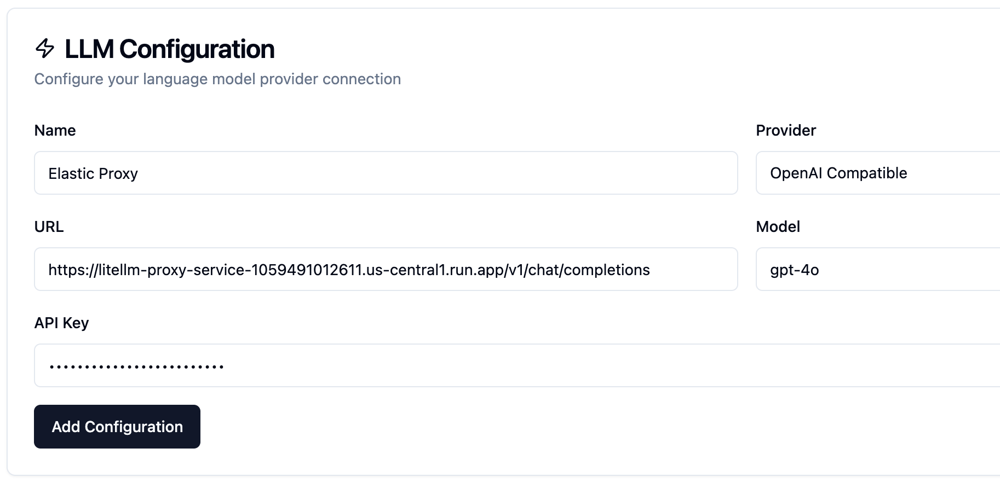
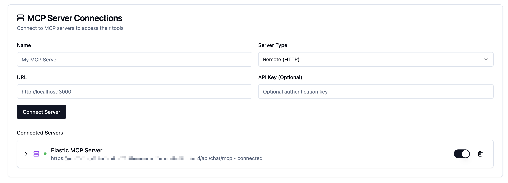
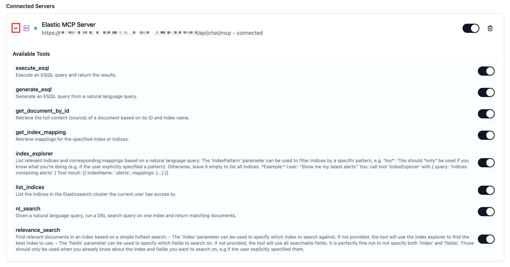
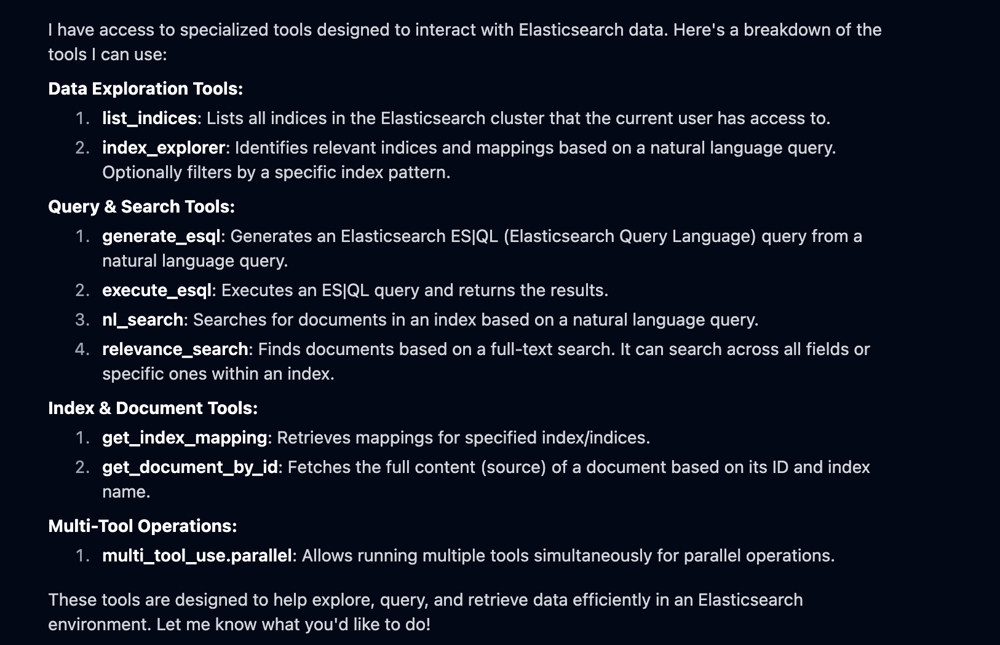

In this chapter, we'll connect to the 1Chat MCP server that's built right into Kibana.

To do this, we'll use a command-line tool called the Simple MCP Client (SMC). This will let us talk to our 1Chat agents directly from our terminal.


1. Starting the Simple MCP Client
===
> [!NOTE]
> We'll be working on the commandline. You can either copy / paste commands into the terminal
> or, simply click the `>run` button to run the command in the active terminal window
> 

First, navigate to the directory where we've already cloned the [SMC repo](https://github.com/jeffvestal/simple-mcp-client).

1.   You should have the **[button label="Terminal 1"](tab-0)** already open.
2.   We've already cloned the [SMC repo](https://github.com/jeffvestal/simple-mcp-client). Run the command below to change into the directory:
```run,bash
cd /workspace/workshop/simple-mcp-client
```
3. Run the setup script to install the dependencies:
```run,bash
./setup.sh
````
3. Next we need to activate the python virtual environment and run the start script:
````run,bash
source backend/venv/bin/activate
./start-dev.sh proxy
````
4. You should see output saying both frontend and backend services are running. Similar to below (the PIDs will be different)
    ```nocopy,bash
     ❯ ./start-dev.sh
    Simple MCP Chat Client - Development Environment
    =============================================
    Starting backend server...
    Backend server started (PID: 40373)
      URL: http://localhost:8002
      Logs: logs/backend.log
    Starting frontend server...
    Frontend server started (PID: 40378)
      URL: http://localhost:5173 (or next available port)
      Logs: logs/frontend.log

    Both servers are running!
    Press Ctrl+C to stop both servers

    Logs are being written to:
      Backend:  logs/backend.log
      Frontend: logs/frontend.log

    You can monitor logs in real-time with:
      tail -f logs/backend.log
      tail -f logs/frontend.log
    ```

Configure the LLM and MCP Server Connections
===
# LLM Configuration
We need to cofifure a Chat LLM for the MCP Client to talk to. We are going to use the Elastic Proxy to talk to a `gpt-4o` model in Elastic's Azure OpenAI tennant.
> [!IMPORTANT]
> While Elastic is not "training" on any of the chat conversations you have, anything you enter into the chat app may be logged.

1. Open the [button label="Simple MCP Client"](tab-2) Tab
2. Click the gear icon in the upper right to open the settings page
    
3. In the LLM Configuration section fill out the following fields:
    - `Name`:
        ```
        Elastic Proxy
        ```
    - `Provider`:
        ```nocopy
        OpenAI Compatible
        ```
    - `URL`:
        ```
[[ Instruqt-Var key="LLM_CHAT_URL" hostname="kubernetes-vm" ]]
        ```
    - `Model`:
        ```
        gpt-4o
        ```
    - `API Key`:
        ```
[[ Instruqt-Var key="LLM_KEY" hostname="kubernetes-vm" ]]
        ```
4. Click "Add Configuration"


---
# MCP Server Connection

Next we need to connet our Elastic MCP Server.

To do this we will connect to the `/api/chat/mcp` endpoint of our Kibana server.

1. If you aren't still in the Settings page, click the gear icon in the upper right to open the settings page
    
2.  In the MCP Server Connections section fill out the following fields:
     - `Name`:
        ```
        Elastic MCP Server
        ```
     - `Server Type`:
        ```nocopy
        remote (HTTP)
        ```
     - `URL`:
        ```
        [[ Instruqt-Var key="KIBANA_URL_UI" hostname="host-1" ]]/api/chat/mcp
        ```
     - `API Key (Optional)`:
        ```
        [[ Instruqt-Var key="ELASTICSEARCH_API_KEY" hostname="host-1" ]]
        ```

---
- `URL`:
[[ Instruqt-Var key="KIBANA_URL" hostname="host-1" ]]

---


3. Click "Connect Server"
You should see the MCP Server Connected


> [!NOTE]
> In addition to the "Connected" and 🟢 status markers on the server line,
> you can also expand the row by clicking the ">" icon to view a list of tools.
> The SMC automatically requests a tools list when it successfully connects to an MCP Server
> 

Let's Chat!
===
Switch back to the Chat page and let's start asking some questions


- We saw the tool list in the settings page, but let's ensure the LLM really knows about them. Paste the following in the chat box:
    ```
    What tools do you know about?
    ```
    You should see a nicely formatted list of tools similar to the screenshot below:
		
- Next lets ask a more complex question that will use some of the tools:
    ````
    Can you tell me what each index could be used for? What type of data is in each one?
    ````
- Next lets ask a more complex question that will use some of the tools:
    ````
    Who has the highest account value and what is their highest valued individual asset?
    ````


.
